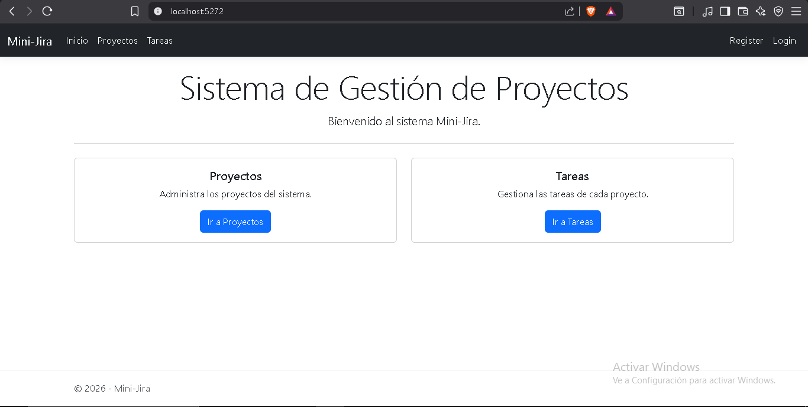
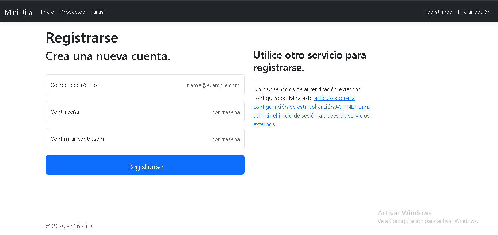
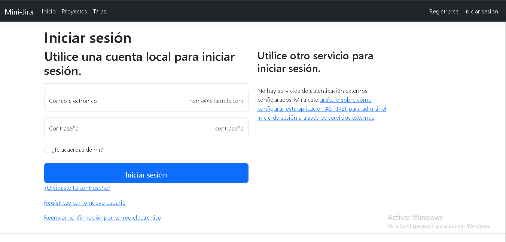
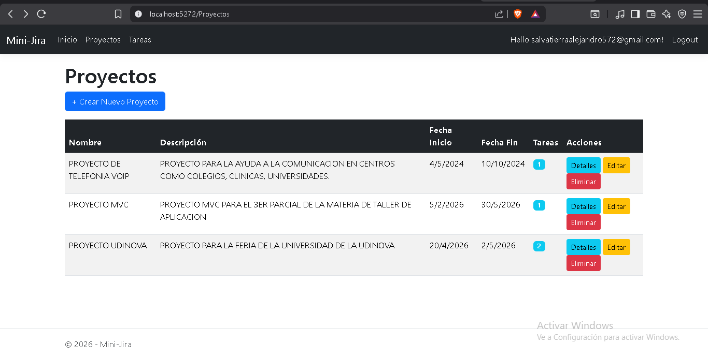
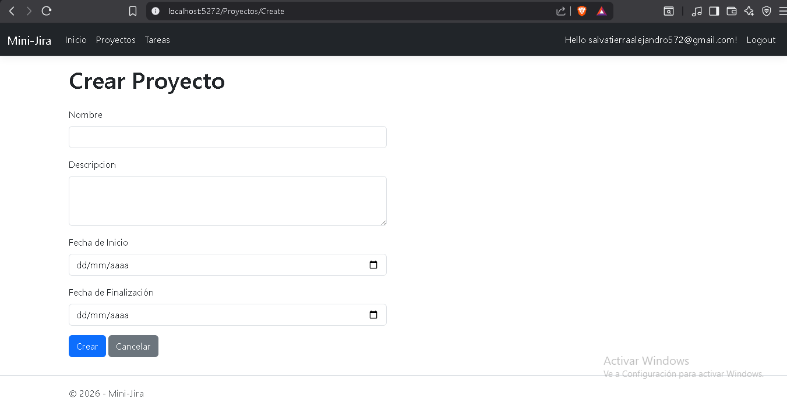
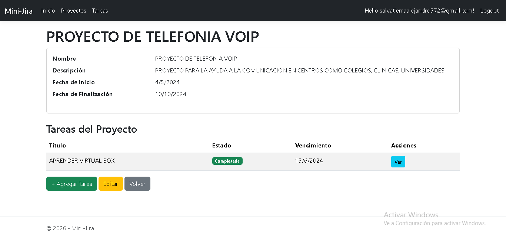
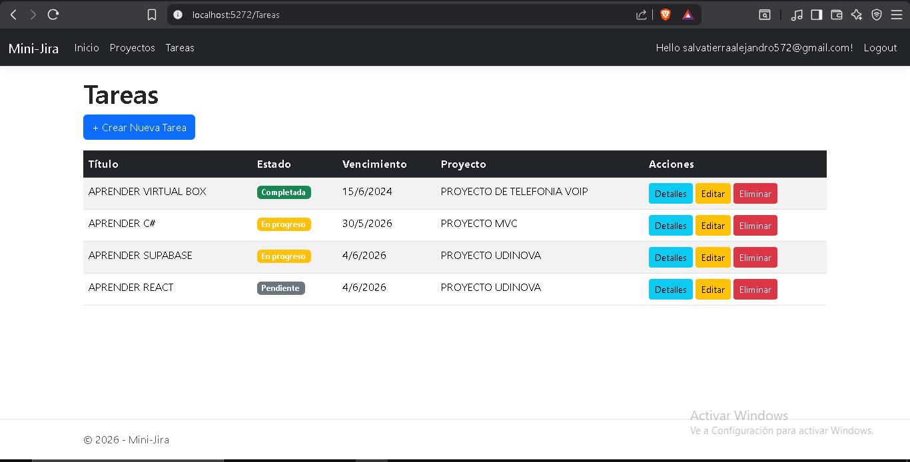

# Sistema de Gestión de Proyectos — Mini-Jira

Examen de Unidad de Aprendizaje Nº3 — DES320 Taller de Diseño de Aplicaciones

---

## Descripción

Aplicación web desarrollada con **ASP.NET Core MVC** y **Entity Framework Core (Code-First)** que permite gestionar Proyectos y las Tareas asociadas a cada uno. Implementa el **Patrón Repositorio**, programación **asíncrona** y protección de rutas con **ASP.NET Identity**.

---

## Tecnologías

- .NET 10
- ASP.NET Core MVC
- Entity Framework Core 10 (Code-First)
- SQL Server Express
- ASP.NET Core Identity
- Bootstrap 5
- Patrón Repositorio con operaciones asíncronas

---

## Arquitectura del Proyecto

| Capa               | Descripción                                                                         |
| ------------------ | ----------------------------------------------------------------------------------- |
| **Models**         | Entidades del dominio: `Proyecto`, `Tarea`                                          |
| **Data**           | `ApplicationDbContext` (hereda de `IdentityDbContext`)                              |
| **Repositories**   | Interfaces (`IProyectoRepository`, `ITareaRepository`) e implementaciones concretas |
| **Controllers**    | `ProyectosController`, `TareasController`, `HomeController`                         |
| **Views**          | Vistas Razor con Bootstrap 5 y Tag Helpers                                          |
| **Areas/Identity** | Páginas de autenticación generadas por ASP.NET Core Identity                        |

---

## Modelos de Datos

### Proyecto

| Propiedad         | Tipo                 | Restricciones                          |
| ----------------- | -------------------- | -------------------------------------- |
| Id                | int                  | PK, autoincremental                    |
| UserId            | string?              | FK → AspNetUsers.Id, Cascade Delete    |
| Nombre            | string               | Required, MaxLength(100)               |
| Descripcion       | string?              | Opcional                               |
| FechaInicio       | DateTime             | Requerida                              |
| FechaFinalizacion | DateTime?            | Opcional                               |
| Tareas            | ICollection\<Tarea\> | Navegación 1:N                         |

### Tarea

| Propiedad        | Tipo      | Restricciones                      |
| ---------------- | --------- | ---------------------------------- |
| Id               | int       | PK, autoincremental                |
| Titulo           | string    | Required, MaxLength(150)           |
| Descripcion      | string?   | Opcional                           |
| Estado           | string    | MaxLength(50), default "Pendiente" |
| FechaVencimiento | DateTime? | Opcional                           |
| ProyectoId       | int?      | FK → Proyecto.Id, Required         |
| Proyecto         | Proyecto? | Navegación hacia el padre          |

---

## Requisitos Previos

- [.NET 10 SDK](https://dotnet.microsoft.com/download/dotnet/10.0)
- SQL Server Express instalado y corriendo
- Entity Framework Core CLI:
  ```bash
  dotnet tool install --global dotnet-ef
  ```

---

## Cadena de Conexión

Configurada en `appsettings.json`:

```json
"ConnectionStrings": {
  "DefaultConnection": "Server=.\\SQLEXPRESS;Database=EXAMENUNI3_DB;Trusted_Connection=True;MultipleActiveResultSets=true;TrustServerCertificate=True"
}
```

---

## Pasos para Compilar y Ejecutar

### 1. Restaurar paquetes NuGet

```bash
dotnet restore
```

### 2. Aplicar migraciones y crear la base de datos

```bash
dotnet ef database update
```

### 3. Compilar y ejecutar

```bash
dotnet run
```

Abrir el navegador en: **http://localhost:5272**

---

## Funcionalidades

- **CRUD completo** de Proyectos y Tareas
- **Autenticación** con ASP.NET Core Identity (Register / Login / Logout)
- **Rutas protegidas**: Crear, Editar y Eliminar requieren autenticación (`[Authorize]`)
- **Aislamiento de datos por usuario**: cada usuario ve y gestiona únicamente sus propios proyectos y tareas. Al crear un proyecto se asigna automáticamente el `UserId` del usuario autenticado; los listados y el dropdown de tareas filtran por ese ID
- **Endpoint JSON**: `GET /Proyectos/GetProyectosJson` devuelve los proyectos del usuario autenticado en formato JSON (requiere autenticación)
- **Bootstrap 5** para UI responsiva
- **Tag Helpers** en todos los formularios
- **Validación** del lado del servidor con Data Annotations
- **Cascade Delete doble**: al eliminar un Usuario se eliminan sus Proyectos; al eliminar un Proyecto se eliminan sus Tareas

---

## Endpoints API

| Método | Ruta                          | Descripción                                         | Requiere Auth |
| ------ | ----------------------------- | --------------------------------------------------- | ------------- |
| GET    | `/Proyectos/GetProyectosJson` | Proyectos del usuario autenticado con tareas en JSON | Sí            |

---

## Capturas de Pantalla









---

## Autor

"JUAN ALEJANDRO SALVATIERRA GUZMAN"

Examen Individual — DES320 Taller de Diseño de Aplicaciones
